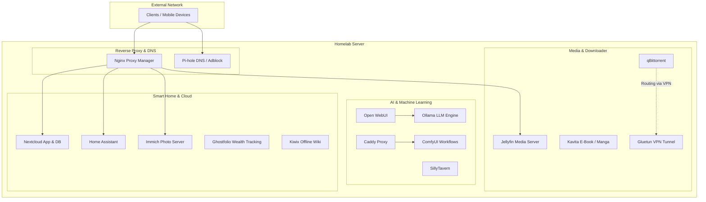

# Self-Hosted Home Server Infrastructure

A modular, Docker-based homelab server on Ubuntu Linux for AI workloads, media streaming, smart home, and private cloud services.


---

## Architecture and Network Overview

---

## Included Services

### AI and Workloads
| Service | Port | Description |
| :--- | :--- | :--- |
| **Ollama + Open WebUI** | `11434` / `3000` | Local LLM inference with GPU acceleration and UI |
| **ComfyUI + Caddy** | `8188` / `8180` | Node-based image generation (Stable Diffusion / Flux) |
| **SillyTavern** | `8000` | Frontend for LLMs and roleplay interfaces |

### Media and Streaming
| Service | Port | Description |
| :--- | :--- | :--- |
| **Jellyfin** | `Host` | Media streaming server with hardware transcoding (NVIDIA) |
| **Kavita** | `5010` | Digital reader for books, comics, and manga |
| **Gluetun + qBittorrent** | `8090` | Secured downloader routed through an isolated VPN container |

### Cloud, Smart Home and Tools
| Service | Port | Description |
| :--- | :--- | :--- |
| **Home Assistant** | `Host` | Smart home automation hub using host network mode |
| **Immich** | `2283` | High-performance photo management and backup with machine learning |
| **Nextcloud** | `8080` | Private cloud storage solution with MariaDB backend |
| **Ghostfolio** | `3333` | Open-source asset and wealth tracking |
| **Pi-hole** | `53` / `8081` | Network-wide adblocker and DNS server |
| **Kiwix** | `8085` | Offline Wikipedia and knowledge base |

---

## Folder Structure

```text
.
├── comfyui-setup/       # ComfyUI Docker setup and Caddyfile
├── ghostfolio/          # Portfolio tracker and Postgres database
├── gluetun/             # Gluetun VPN and qBittorrent network stack
├── home_assistant/      # Smart home automation configuration
├── immich/              # Photo backup and ML engine
├── jellyfin/            # Media server configuration
├── kavita/              # E-Book and comic library
├── kiwix/               # Offline Wiki server
├── llm/                 # Ollama and Open WebUI stack
├── nextcloud/           # Nextcloud and MariaDB configuration
├── pihole/              # DNS adblocker configuration
├── sillytavern/         # LLM interface
├── docker-update.sh     # Automated update script for all containers
└── server-backup.sh     # Automated backup script for configurations
```

---

## Quick Start

### 1. Clone Repository
```bash
git clone [https://github.com/YOUR_USERNAME/homeserver-repo.git](https://github.com/YOUR_USERNAME/homeserver-repo.git)
cd homeserver-repo
```

### 2. Configure Environment Variables
Several services require local credentials. Copy the example files and enter your specific passwords or API keys before starting:

```bash
cp immich/.env.example immich/.env
nano immich/.env
```

### 3. Start a Service
Navigate to the desired service directory and start it using Docker Compose:

```bash
cd jellyfin
docker compose up -d
```

---

## Maintenance and Automation

This repository includes custom shell scripts for server management:

* **Automated Updates (`docker-update.sh`):**
  Iterates through all directories, pulls the latest Docker images, restarts the containers, and prunes unused images.
  ```bash
  chmod +x docker-update.sh
  ./docker-update.sh
  ```

* **Backup Script (`server-backup.sh`):**
  Backs up configuration files, Compose setups, Nginx Proxy Manager data, and system information to an external backup drive.
  ```bash
  # Dry run without writing files
  ./server-backup.sh --dry-run

  # Execute full backup
  ./server-backup.sh
  ```

---

## Security Note

This public repository contains **no real passwords, API keys, or certificates**. All sensitive data is handled via `.env` files, which are excluded from version control via `.gitignore`.